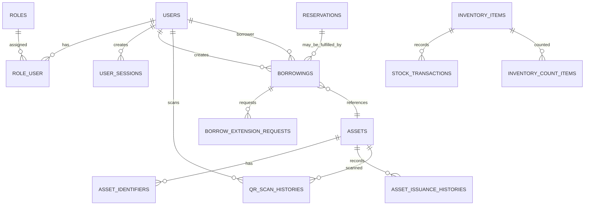

# Entity Relationship Overview (implementation-backed)

This high-level ER overview shows core relationships verified from migrations and Eloquent models. Only relationships with verified foreign keys or model relationships are shown.

Mermaid ERD (verified relationships)

Notes on the diagram

- USERS ↔ ROLES is a many-to-many relationship implemented via the pivot table `role_user` (foreign keys to `roles` and `users`). See: backend/database/migrations/*create_role_user_table.php and backend/app/Models/User.php

- Borrowings reference users and assets with foreign keys (`user_id`, `asset_id`) and have a one-to-many relationship with borrow_extension_requests. See migrations: `create_borrowings_table.php`, `create_borrow_extension_requests_table.php`.

- Assets have many asset_identifiers (asset_identifiers table) and issuance histories. See migrations: `create_assets_table.php`, `create_asset_identifiers_table.php`, `create_asset_issuance_histories_table.php`.

- Inventory items, stock transactions, and count sessions are related in inventory migrations (look for `create_inventory_items_table.php`, `create_stock_transactions_table.php`, `create_inventory_count_tables.php`).

- The ERD intentionally omits lower-level join tables and service-only relationships that are not enforced by foreign keys.

Source references

- backend/database/migrations/
- backend/app/Models/
- backend/app/Modules/*/Models/

If you need a more detailed ERD (including all FK constraints and column names), request a follow-up and specify the domain scope (Users, Assets, Inventory, Borrowing, etc.).
